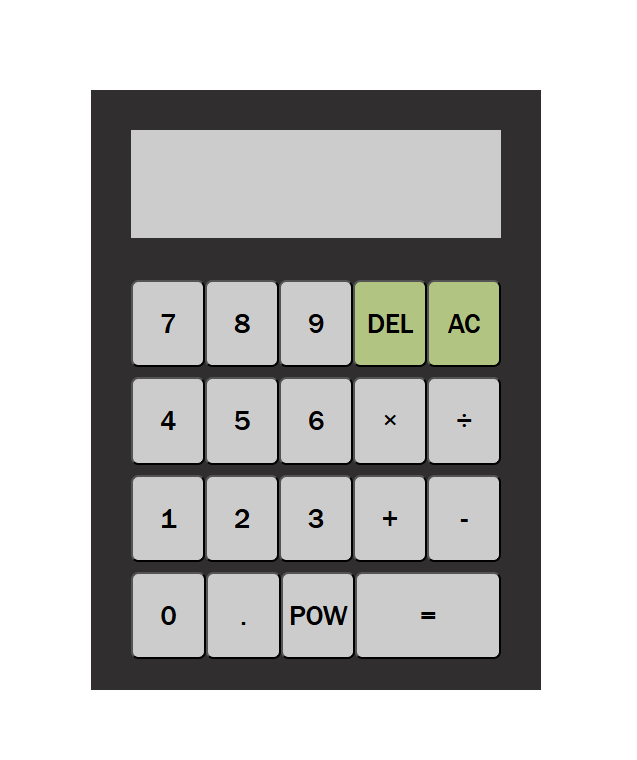

# Calculator

A simple calculator built with HTML, CSS, and JavaScript. Supports basic arithmetic operations (addition, subtraction, multiplication, division, powering), clearing, deleting, and floating-point numbers (up to 10 decimals).

📸 Preview

🚀 Usage

- Clone the repo or download the files

- Open index.html in your browser

✨ Features

- Basic math operations

- Clear & delete buttons

- Handles floating-point precision 

- Clean UI

🔮 Future Ideas (optional)

- Add keyboard support

- Support parentheses 

